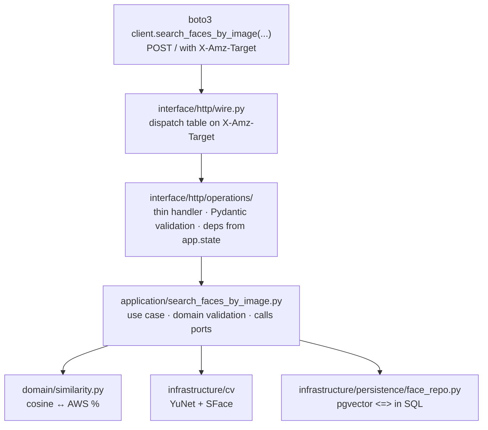

# Architecture

The codebase is layered (domain-driven), with one rule held throughout: **each
layer may only import from the layer below it**. `domain/` contains zero
references to `infrastructure` or `interface`.

## How a request flows

A `search_faces_by_image` call crosses three layers:



Each layer's job:

- **`interface/http`** — knows AWS JSON-1.1. Doesn't know about embeddings or SQL.
- **`application`** — knows the use case. Doesn't know about HTTP or which cv2 class detects faces.
- **`domain`** — pure Python. No I/O, no FastAPI, no cv2, no asyncpg.
- **`infrastructure`** — adapters (cv2, asyncpg, pgvector) implementing the protocols in `application/ports.py`.

You can replace pgvector with another vector store by rewriting
`infrastructure/persistence/` and touching nothing else.

## Layered structure

```
src/
├── domain/                       pure, zero I/O
│   ├── face.py                   Face, BoundingBox, Landmark
│   ├── embedding.py              Embedding (128-d, L2-normalised)
│   ├── face_record.py            FaceRecord aggregate
│   ├── collection.py             Collection aggregate, validate_collection_id()
│   ├── similarity.py             cosine ↔ AWS-style percentage
│   ├── quality.py                QualityFilter, assess_face()
│   └── errors.py                 DomainError → AWS error code mapping
├── application/                  use cases (one per operation)
│   ├── ports.py                  FaceDetector, FaceRecognizer, repositories (Protocol)
│   ├── detect_faces.py
│   ├── compare_faces.py
│   ├── index_faces.py
│   ├── search_faces_by_image.py
│   └── … (5 more, mostly DB-only)
├── infrastructure/
│   ├── cv/
│   │   ├── model_loader.py       checksum-verified download from opencv_zoo
│   │   ├── yunet_detector.py     queue.SimpleQueue of cv2.FaceDetectorYN
│   │   ├── sface_recognizer.py   queue.SimpleQueue of cv2.FaceRecognizerSF
│   │   └── image_decoder.py      base64 + PIL → np.ndarray BGR
│   └── persistence/
│       ├── db.py                 asyncpg pool, run_migrations()
│       ├── collection_repo.py
│       └── face_repo.py          only place with pgvector <=> in SQL
└── interface/http/
    ├── app.py                    FastAPI factory + lifespan
    ├── wire.py                   POST / → X-Amz-Target dispatch, AWS errors
    ├── schemas.py                Pydantic models with PascalCase aliases
    └── operations/               one file per X-Amz-Target action
```

## The AWS wire protocol

Rekognition is JSON-1.1, single endpoint, dispatched by header:

```
POST / HTTP/1.1
X-Amz-Target: RekognitionService.DetectFaces
Content-Type: application/x-amz-json-1.1
Authorization: AWS4-HMAC-SHA256 …          ← we ignore this

{"Image": {"Bytes": "<base64>"}, "Attributes": ["DEFAULT"]}
```

`wire.py` is the entire dispatch — a `dict[str, Handler]` keyed by the part
after the dot in `X-Amz-Target`. Adding an operation is: write the use case,
write the handler, add one line to the dispatch table. SigV4 verification is
skipped entirely — `Authorization` headers can be anything.

## Why this stack

- **YuNet (232 KB)** — accurate small-face detector, ~5 ms/call on CPU. Returns confidence and 5 landmarks, which is what SFace needs for alignment.
- **SFace (38 MB)** — 128-d embedding network, CPU-only, ~10 ms/face. Native threshold cos ≥ 0.363, mapped to an AWS-style percentage.
- **pgvector + HNSW** — one binary you already know how to back up, `O(log N)` search, `vector_cosine_ops` for L2-normalised vectors (we L2-normalise on insert).
- **FastAPI** — thin ASGI shell over the dispatcher; no `Depends`, no router magic.
- **asyncpg** — fast Postgres driver, pairs with `pgvector.asyncpg.register_vector`.
- **uv** — lockfile-driven venv + install + run.
- **alembic** — plain schema migrations; the `vector` extension is created in the first migration.
