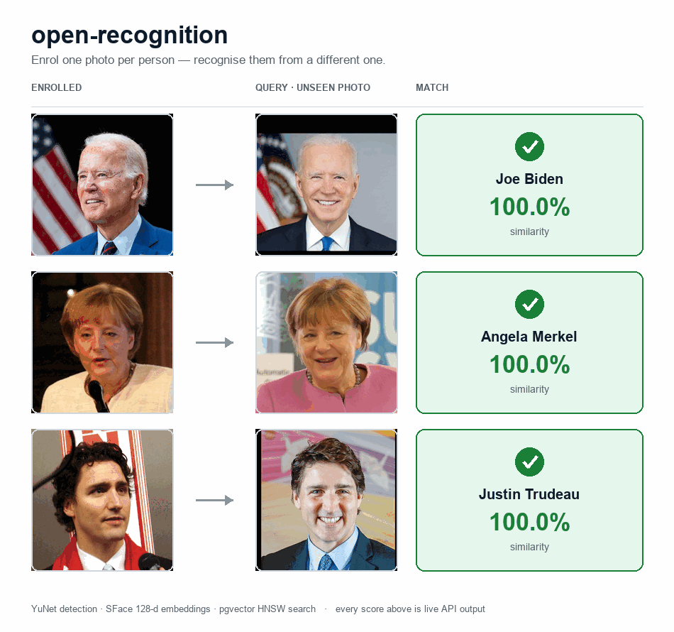

# open-recognition

A free, self-hosted, **boto3-compatible drop-in for the AWS Rekognition Faces
API**. You point `boto3.client("rekognition")` at this server with one
argument and keep your existing code. No vendor lock-in, no per-image billing,
no images leaving your network — and it doubles as a local Rekognition mock for
tests and CI.

```python
client = boto3.client(
    "rekognition",
    endpoint_url="http://localhost:8080",   # ← only line that changes
    region_name="us-east-1",
    aws_access_key_id="x", aws_secret_access_key="x",  # ignored by the server
)
client.create_collection(CollectionId="team")
client.index_faces(CollectionId="team", Image={"Bytes": jpeg}, ExternalImageId="alice")
client.search_faces_by_image(CollectionId="team", Image={"Bytes": jpeg})
```

Behind the scenes it's [YuNet] for detection, [SFace] for 128-d embeddings, and
pgvector's HNSW index for sub-millisecond search. **Embeddings, not images, are
stored.**

[YuNet]: https://github.com/opencv/opencv_zoo/tree/main/models/face_detection_yunet
[SFace]: https://github.com/opencv/opencv_zoo/tree/main/models/face_recognition_sface

## Where to start

- [Installation](installation.md) — `docker compose up`, Helm, or straight from `uv`.
- [Quickstart](quickstart.md) — boto3 and raw-HTTP snippets you can paste.
- [API reference](api.md) — the live Swagger UI, rendered from the shipped OpenAPI spec.
- [Operations](operations.md) — the ten Faces operations, attributes, and the quality filter.
- [Architecture](architecture.md) — the layered (DDD) design and how a request flows.
- [Deployment](deployment.md) — Docker Compose and the Helm chart.

## What you get

| | open-recognition | AWS Rekognition Faces API |
|---|---|---|
| **SDK** | `boto3.client("rekognition", endpoint_url=…)` | `boto3.client("rekognition")` |
| **Wire protocol** | AWS JSON-1.1 (identical) | AWS JSON-1.1 |
| **Operations** | 10 Faces API operations | All Faces + Labels + Moderation + … |
| **Detector** | YuNet (`face_detection_yunet_2023mar.onnx`, 232 KB) | proprietary |
| **Recognizer** | SFace (`face_recognition_sface_2021dec.onnx`, 38 MB, 128-d) | proprietary |
| **Vector store** | Postgres + pgvector HNSW (`vector_cosine_ops`) | proprietary |
| **Throughput (one process)** | ~290 detect+embed/sec at pool=8, 5 800 search/sec | unbounded, you pay per call |
| **Search latency p95** | 4 ms (5 000 faces, local PG) | tens of ms over network |
| **Cost per million faces** | ~$0 (electricity) + 2.5 GB disk | $1 per 1 000 IndexFaces (~$1 000) + storage |
| **Where your photos go** | your Postgres | AWS |

If you only use the Faces API and want a self-hosted alternative that stops the
per-image billing, this is a straight swap. If you need `DetectLabels`, age
estimation, or video — keep using real Rekognition.

## Recognising real faces

{ width="640" }

Enrol one photo per person, search with a *different* one — every score above
is live API output. See [Operations](operations.md) for the full list of what
the server supports.

## License

Source: MIT. Bundled model weights are redistributed under permissive licences
(MIT / Apache 2.0) with attribution preserved — see the repository
[`README`](https://github.com/eslazarev/open-recognition#models-and-credits).
